# Kenya Groundwater Lens

Kenya Groundwater Lens turns **21,284 mapped records** of wells, boreholes and springs into a clear water story, a set of notebook analyses and an interactive web dashboard.

The project has one main message:

> The mapped inventory is a useful national screening tool, but it is not a complete census of Kenya's groundwater sources.

The map helps people find patterns and decide where to look next. That matters because a borehole may be on private land while the groundwater resource is shared and legally held in trust for the public. The map cannot, by itself, prove how much groundwater exists, who owns a source, whether it has a permit or whether money is owed.

This document has three parts:

1. **The groundwater story** — what the findings mean for a general reader.
2. **The analysis workflow** — how the notebook and scripts turn the source data into the map outputs.
3. **The application** — how the static HTML, CSS, JavaScript and MapLibre dashboard is organised and run.

---

## Part 1 — The groundwater story

### The lead: what 21,284 mapped records reveal—and hide

The cleaned inventory contains **21,284 mapped water-source records across 40 counties**. It brings many wells, boreholes and springs into one public view. That makes it a strong starting point for national screening and field planning.

The important catch is that the map shows **where records were collected**. It does not show every groundwater source in Kenya. A bright area may have been surveyed more often. A quiet area may simply have fewer records.

The inventory should therefore be used as a starting line for checking, not as a final conclusion.

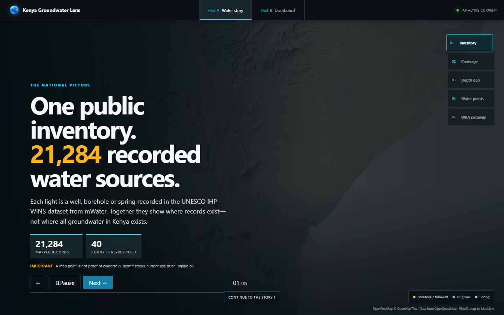

The animated opening now frames the map as a set of questions: where records are concentrated, which values need checking, where evidence is thin and how a mapped dot can become a confirmed record.

### The written story: from map pattern to evidence

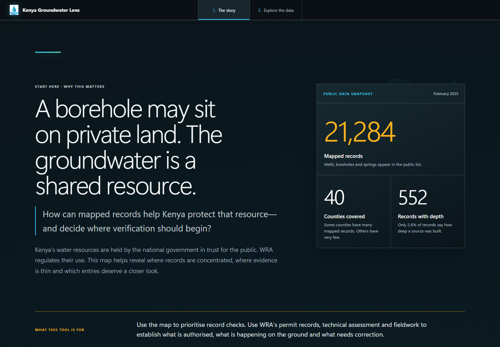

The written story begins with the central reading rule and a compact data snapshot before explaining clusters, gaps, depth values, WRA's role and the shared checking process.

### Why borehole records matter

Groundwater does not stop at a property boundary. A borehole can draw from an aquifer shared with neighbouring users and connected environments. Kenya's Water Act therefore vests water resources in the national government in trust for the people, and WRA regulates their management and use.

The story presents the general path in three parts:

1. **Before construction:** apply to WRA and obtain the required approval or authorisation before constructing abstraction works.
2. **Before abstraction:** complete the required records and checks; authorisation to construct does not by itself permit water abstraction.
3. **While using water:** follow permit conditions, measure and report use where required, and pay the applicable permit fees and water-use charges.

Requirements and charges depend on the use category and current regulations. Users should confirm their particular case through [WRA's permitting guidance](https://wra.go.ke/water-use-allocation/) and the [Water (Resources) Regulations, 2025](https://new.kenyalaw.org/akn/ke/act/ln/2025/58/eng@2025-03-07/source). The dashboard is not WRA's permit or billing database and cannot establish compliance from a mapped point.

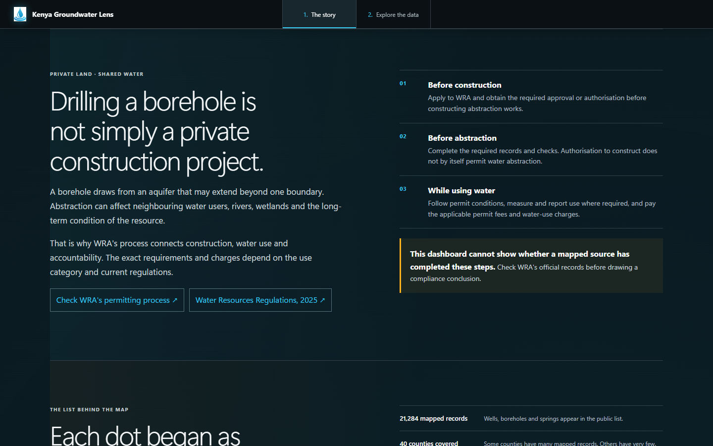

### The data breakdown: what is in the inventory

| Finding                          | Result        | Simple meaning                                                     |
| -------------------------------- | ------------: | ------------------------------------------------------------------ |
| Total mapped records             | **21,284**    | Public-dataset entries with locations that can be shown on the map |
| Counties represented             | **40**        | Seven counties have no mapped record in this dataset               |
| Kakamega mapped records          | **12,722**    | The largest mapped county group                                    |
| Vihiga mapped records            | **2,779**     | The second-largest mapped county group                             |
| Kakamega and Vihiga combined     | **72.8%**     | Nearly three quarters of the mapped inventory are in two counties  |
| Mapped well and borehole records | **13,645**    | The other **7,639** mapped records are springs                     |
| Usable construction depths       | **552**       | Only **2.6%** of all records can support depth comparisons         |
| Median construction depth        | **75 metres** | The middle value among the 552 usable depth records                |

#### The illusion of abundance

Kakamega and Vihiga contain **15,501 mapped records**, or **72.8%** of the mapped inventory.

This does not mean that these two counties contain 72.8% of Kenya's groundwater. It means that this public inventory has much stronger coverage there. The record-density and 3D density maps make this survey pattern easy to see.

#### The depth data black box

Only **552 records** have a usable construction depth. That is **2.6%** of the inventory. More than 97% cannot be used for a depth comparison.

The median recorded construction depth is **75 metres**. This is the depth to which the source was built. It is not the depth of the water table, the amount of water available, the pumping rate or the safe yield.

The 3D depth map requires at least five usable depth records in a grid cell before it treats the cell as a result. Cells with fewer measurements are shown in grey.

### The caveat: a tool, not a census

The dashboard must be read with four simple rules:

- A **bright cluster** means more mapped records in this inventory, not automatically more groundwater.
- A **blank or quiet area** means less nearby information, not proof that groundwater is absent.
- A **depth line or column** shows recorded construction depth, not the water table.
- A **map point** is a lead to check, not proof of an owner, permit, offence or unpaid bill.

The groundwater record coverage gap view shows how far each national grid cell is from the nearest mapped record. It is useful for planning more data collection. It does not map dry land or groundwater scarcity.

### The WRA opportunity: from map to management

The gaps do not make the map useless. They show where the Water Resources Authority (WRA), counties, researchers, communities and private operators can work together.

The project proposes one shared five-step checking process:

1. **Spot it.** Pick a dot or pattern that needs a closer look.
2. **Find the record.** Look for the source in WRA's records and trace the original survey entry.
3. **Compare the papers.** Match it with available permits, applications, borehole logs and completion records.
4. **Visit the site.** Confirm the source, its condition, who uses it and any details that need checking.
5. **Confirm or correct.** Keep a supported record, correct it where needed and note what remains uncertain.

WRA says its permit process includes an application, approval to build abstraction works, site checks, completion records and permit issue. It also says categories B, C and D are linked to economic water use and payment for the amount used. This project does not replace that process.

The map cannot produce a bill because the public data does not confirm the permit holder, permit status, water-use category, permitted amount, meter number, measured volume or payment history.

### The conclusion: digital clues, field evidence

Digital maps make large patterns easier to see. They help people ask better questions and plan where to work. Fair groundwater management, however, depends on official records, visits to real sites and reliable measurements.

The practical question is: **where should WRA and its partners verify first?** The dashboard supports that decision by showing where mapped records are concentrated, where information is thin and which values deserve a closer look.

**The inventory is the starting line. Fieldwork is what turns it into trusted evidence.**

### Screenshot guide: what each dashboard view means

The screenshots below come from `groundwater-story-map/docs/images/`. All nine were recaptured from the current interface after the layout, wording and control changes. Each view displays only the layer needed for that analysis, so a heatmap is not covered by a second point layer and a 3D surface is not mixed with another result.

The dashboard no longer uses hover-only question-mark identifiers. Control guidance now appears permanently in the written story under **Explore the analysis · Nine views, three questions**, while the right-hand dashboard panel explains the active view without covering the map.

The README uses relative image links. This allows the same images to appear when the project is opened locally or viewed from a repository, without depending on the original `F:` drive location.

#### 1. Mapped-record density

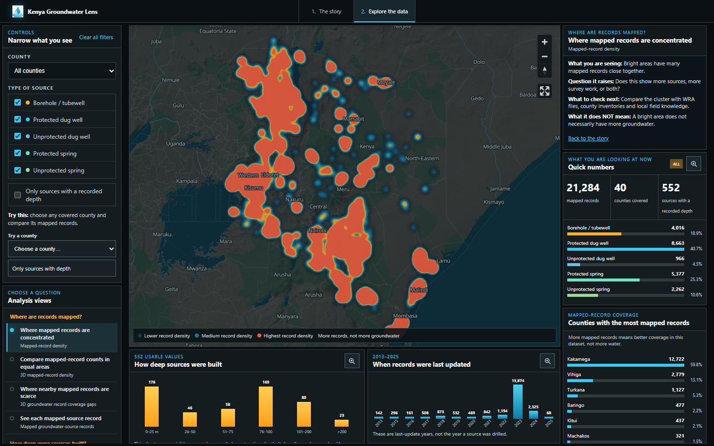

- **What it shows:** a 2D heatmap of places where many mapped inventory records sit close together.
- **What it means:** the strong western hotspot mainly shows where data collection was concentrated. It must not be read as proof that those places hold more groundwater.

#### 2. 3D mapped-record density

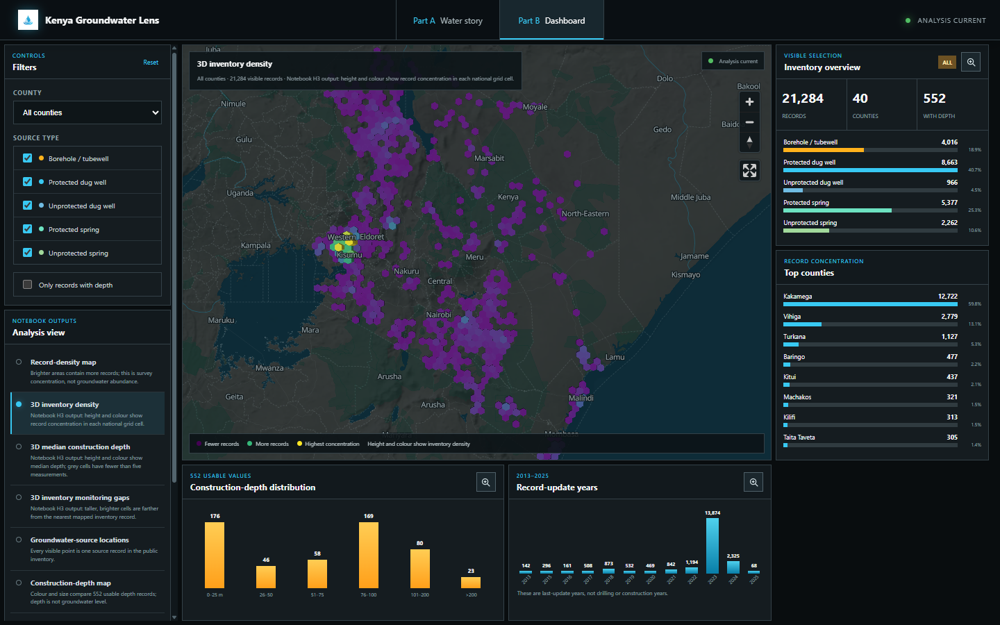

- **What it shows:** mapped groundwater-source records grouped into H3 hexagons. Taller columns contain more records.
- **What it means:** the large difference between western Kenya and much of the country is a coverage imbalance in this inventory. The columns compare record counts, not aquifer size or water yield.

#### 3. 3D median construction depth

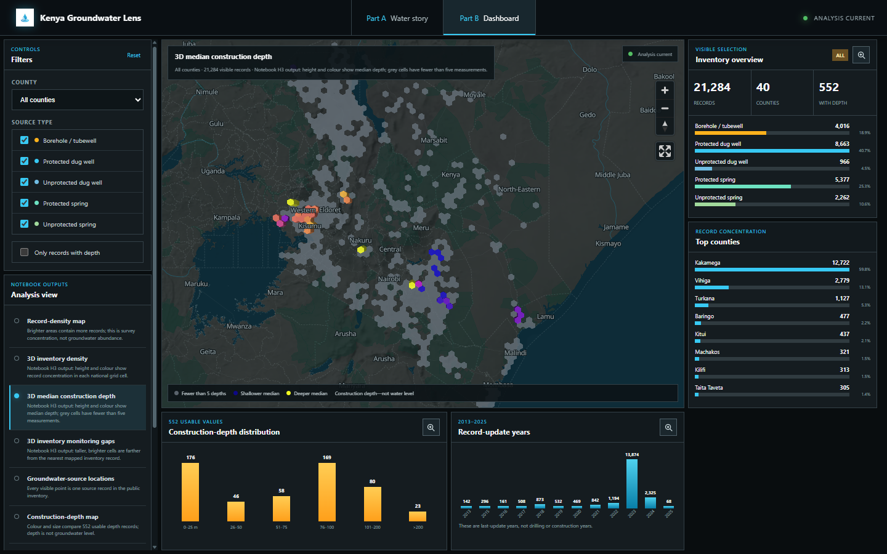

- **What it shows:** the median recorded construction depth in grid cells that have at least five usable depth values. Grey cells do not meet that minimum.
- **What it means:** it supports cautious comparison between well-construction records. It does not show the water table or the amount of water available underground.

#### 4. 3D groundwater record coverage gaps

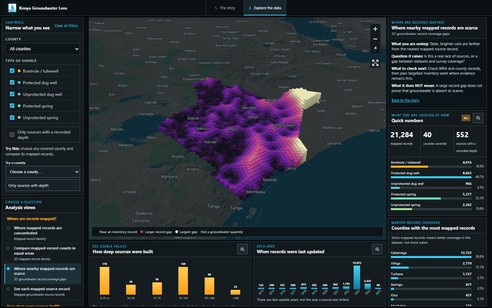

- **What it shows:** the distance from each national grid cell to the nearest point in this public inventory.
- **What it means:** taller cells identify places where the inventory gives less nearby information and where more checking may be useful. They do not prove that groundwater is absent.

#### 5. Groundwater-source locations

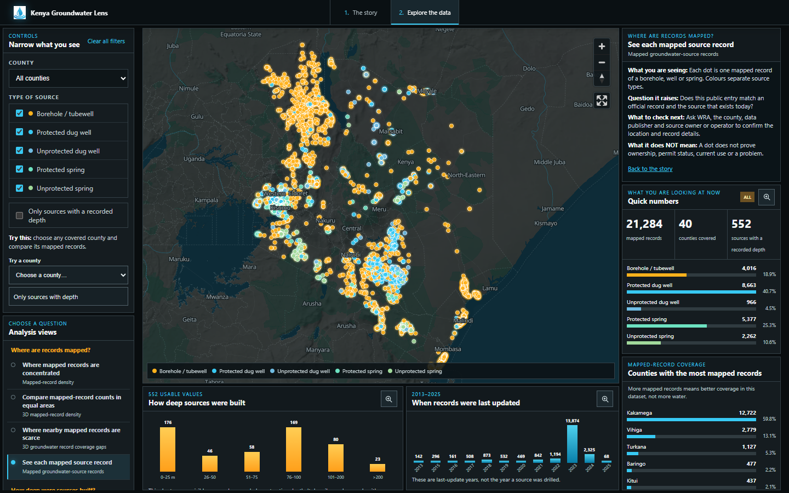

- **What it shows:** individual mapped records of boreholes, protected dug wells, unprotected dug wells and springs, coloured by source type.
- **What it means:** this is the best view for locating and filtering known records. Each point is a lead for field verification, not proof of ownership, permit status or current use.

#### 6. Construction-depth records

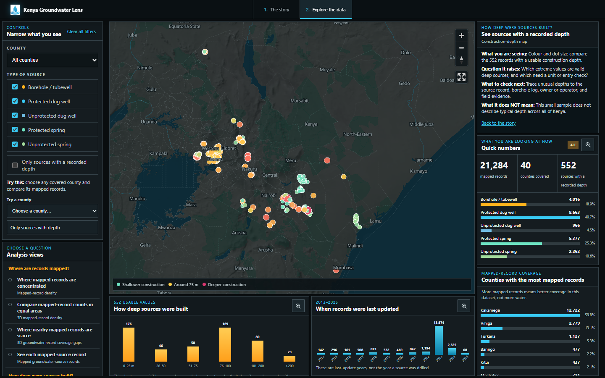

- **What it shows:** only the 552 records with a usable construction depth.
- **What it means:** the small and uneven sample explains why national depth conclusions must remain careful. A mapped value is construction depth, not measured groundwater level.

#### 7. Depth-data coverage

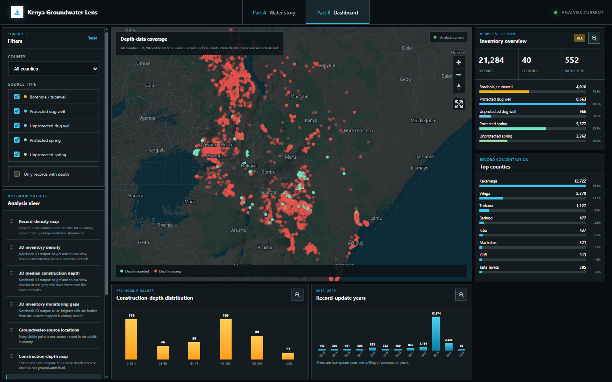

- **What it shows:** records with usable construction depth compared with records that do not have a usable value.
- **What it means:** the missing-depth pattern is itself an important result: 97.4% of records cannot support construction-depth comparison.

#### 8. Record-update timeline

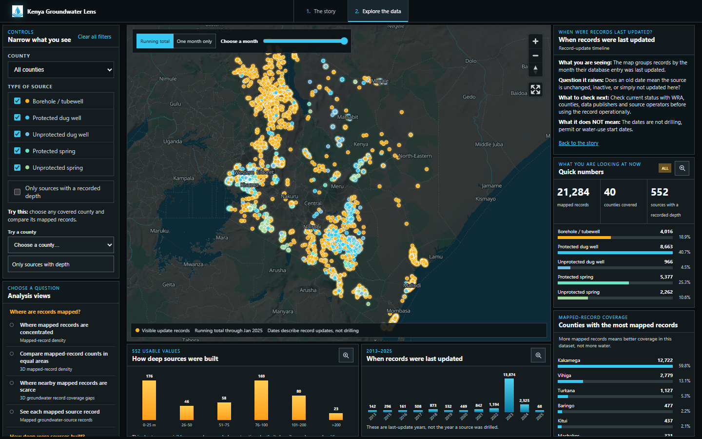

- **What it shows:** records filtered by the month or year in which their inventory entry was last updated.
- **What it means:** it helps explain how the dataset grew and where updates were concentrated. The update date is metadata; it is not the date when a source was drilled.

#### 9. Wells below ground

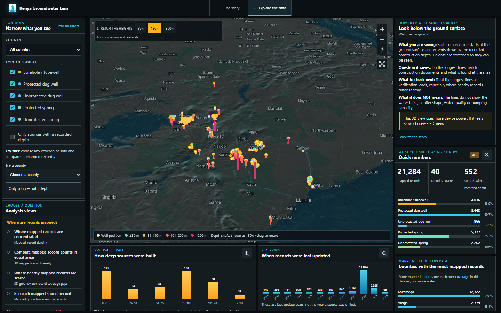

- **What it shows:** the 552 usable construction depths drawn downward from their mapped ground positions on 3D terrain.
- **What it means:** it makes recorded construction depth easier to compare with the landscape. It is an explanatory model, not an underground survey or a picture of the water table.

The **30×, 150× and 300×** options are visual display scales. They make short underground shafts visible at national scale. Popups and charts continue to report the original depth in metres.

### Data source and acknowledgement

The main source is **[Kenya — Groundwater Sources from mWater, UNESCO IHP-WINS](https://ihp-wins.unesco.org/dataset/kenya-groundwater-sources-from-mwater)**.

The source describes wells, dug wells, tubewells, boreholes and springs from mWater in Kenya as of February 2025. This project acknowledges mWater, UNESCO's International Hydrological Programme Water Information Network System, the dataset creator and maintainer, and the organisations and communities that collected the field information.

Other sources used in the maps are:

- **GADM 3.6** county boundaries for the national analysis grid;
- **OpenFreeMap, OpenMapTiles and OpenStreetMap contributors** for the map background; and
- **Mapzen/AWS Terrarium** tiles for terrain height.

### Responsible use and official references

This project supports screening, research and discussion. It is not legal advice, an official WRA register, a hydrogeological survey, a list of illegal sources or an automatic billing system.

Operational work should check the latest law, WRA notices, permit records and rates. The current project references are:

1. [UNESCO IHP-WINS: Kenya — Groundwater Sources from mWater](https://ihp-wins.unesco.org/dataset/kenya-groundwater-sources-from-mwater)
2. [Water Resources Authority: water-use permitting](https://wra.go.ke/water-use-allocation/)
3. [Water (Resources) Regulations, 2025 — Kenya Law](https://new.kenyalaw.org/akn/ke/act/ln/2025/58/eng@2025-03-07)
4. [Water Act, 2016 — Kenya Law](https://new.kenyalaw.org/akn/ke/act/2016/43)
5. [WRA legal notices](https://wra.go.ke/legal-notices/)

Last source check: **6 October 2026**.

---

## Part 2 — Analysis workflow

This part explains how the notebook turns the source file into the results used by the dashboard.

### Main analysis files

- `kenya_groundwater_mwater_migrated.csv` — retained source-stage groundwater data.
- `groundwater_cleaned.csv` — cleaned records used by the upgraded notebook and web-data scripts.
- `Underground_analysis.ipynb` — notebook that creates and explains the spatial analyses.
- `gadm36_KEN_1.*` — local Kenya county-boundary input used when regenerating the national surfaces. These shapefile components are intentionally excluded from Git.

### Step 1 — Read and check the records

The workflow reads the groundwater table and checks the fields needed for mapping:

- longitude and latitude;
- source type;
- county name;
- source name and original ID;
- construction depth;
- record-update date; and
- elevation where it is available.

Rows without usable coordinates cannot be placed on the map. Source types and county names are made consistent so that they can be counted and filtered.

### Step 2 — Prepare construction depth

The workflow separates records with a depth value from records without one. Depth values marked for review are not used in depth statistics.

The cleaned data contains 561 depth values. Nine values above 1,000 metres were flagged for review, leaving **552 usable depth records**.

The workflow then calculates the median and the depth ranges used in maps and charts. Every output keeps the same warning: construction depth is not groundwater level.

### Step 3 — Count and compare

The notebook calculates:

- total records;
- records by county;
- records by source type;
- the share in Kakamega and Vihiga;
- records with usable depth;
- median depth; and
- record-update months and years.

These checks create the headline numbers shown in the story and dashboard.

### Step 4 — Build the H3 grid analyses

H3 divides the country into equal-style hexagonal cells at resolution 5. The notebook and preparation script use those cells for three national comparisons:

1. **Inventory density:** count the records inside each cell.
2. **Median construction depth:** calculate a median only when a cell has at least five usable depth values.
3. **Groundwater record coverage gap:** measure the straight-line distance from each cell centre to the nearest mapped record.

The density surface uses a square-root display scale so the very large western counts do not hide smaller patterns elsewhere. The record coverage gap search uses a fast nearest-point tree. These display choices change how the map is drawn; they do not change the source values shown in popups.

### Step 5 — Build the terrain and time views

The terrain analysis places each usable depth record at the ground surface and draws its construction depth downward. Vertical exaggeration is needed because tens of metres are hard to see on a country-wide map.

The time analysis uses the record's last-update month. It can show all records updated up to a month or only records updated in one month. These dates do not tell us when a source was drilled.

### Step 6 — Create notebook outputs

The notebook produces these detailed HTML files:

| Notebook output                       | What it shows                             | Dashboard equivalent                |
| ------------------------------------- | ----------------------------------------- | ----------------------------------- |
| `gw_hex_density_3d.html`            | H3 mapped-record counts                   | 3D mapped-record density            |
| `gw_hex_depth_3d.html`              | H3 median construction depth              | 3D median construction depth        |
| `gw_monitoring_gap_3d.html`         | Distance to the nearest record            | 3D groundwater record coverage gaps |
| `gw_terrain_wells_entire_area.html` | National terrain and downward well lines  | Wells below ground                  |
| `gw_time_filter_lonboard.html`      | Month-based update filter                 | Record-update timeline              |
| `gw_cross_section.html`             | West-to-east profile of well construction | Notebook reference only             |
| `gw_depth_by_type.html`             | Depth distribution by source type         | Linked dashboard depth chart        |
| `gw_depth_by_county.html`           | Depth distribution by county              | Linked dashboard filters and charts |

The large notebook HTML files remain useful for detailed review. The web app rebuilds their main ideas as lighter MapLibre layers so users do not have to load several large standalone maps.

### Step 7 — Prepare small browser files

Run the two preparation scripts from the workspace root:

```powershell
python groundwater-story-map/scripts/prepare_story_data.py
python groundwater-story-map/scripts/prepare_notebook_surfaces.py
```

The scripts perform these tasks:

1. `scripts/prepare_story_data.py`

   - reads `groundwater_cleaned.csv`;
   - calculates the story totals;
   - makes a compact point bundle; and
   - splits point data into fixed zoom-7 GeoJSON chunks with no more than 900 features per file.
2. `scripts/prepare_notebook_surfaces.py`

   - builds the H3 density cells;
   - builds the depth cells;
   - calculates nearest-record distances; and
   - writes one compact national surface file.

The browser files are:

- `public/data/animation-points.json` — all 21,284 compact records for the story and dashboard;
- `public/data/story-summary.json` — checked headline totals;
- `public/data/notebook-surfaces.geojson` — 2,213 H3 cells for the three national 3D views;
- `public/data/tiles/` — small point-data chunks; and
- `public/data/tiles/tile-index.json` — the list of those chunks.

### Reproduce the notebook analysis

Open `Underground_analysis.ipynb` and run the cells from top to bottom after the cleaned CSV exists.

The main Python packages are pandas, GeoPandas, NumPy, SciPy, H3, PyDeck, Plotly and Lonboard. Some maps also need internet access for their background or terrain tiles.

### Checks built into the analysis

- Depth values marked for review are excluded from depth results.
- A depth hexagon needs at least five measurements.
- Missing depth stays missing; it is not changed to zero.
- Update dates are labelled as metadata dates, not drilling dates.
- Record coverage gaps are labelled as data gaps, not groundwater scarcity.
- Every national count used by the app comes from the prepared summary.

---

## Part 3 — Application development

### What the application contains

The application has two main screens:

- **The story:** a five-scene animated introduction followed by an editorial written story that explains how to read the evidence.
- **Explore the data:** nine map views, filters, statistics and charts based on the notebook findings.

The five story scenes follow this order:

1. **The question:** 21,284 mapped water-source records across 40 counties.
2. **The catch:** 72.8% of mapped records sit in Kakamega and Vihiga.
3. **Question the data:** unusual 300-metre and 280-metre entries in Busia illustrate why precise values may still need checking.
4. **Read the gaps:** blank space means missing evidence, not missing groundwater.
5. **From dot to evidence:** a shared five-step process turns a map clue into a checked record.

The written story then develops those ideas through permanent reading guides, a plain-language explanation of WRA's role, the **Explore the analysis · Nine views, three questions** section and the same five-step checking process used in the animated introduction.

### Technology

- **HTML5** provides the story and dashboard structure.
- **CSS3** provides the responsive layouts, map controls, panels, charts and story presentation.
- **Vanilla JavaScript** manages navigation, filters, story scenes, charts, map state and accessibility behaviour.
- **MapLibre GL JS 5.12** draws the 2D maps, 3D H3 columns, terrain, popups and fullscreen view. Its browser files are stored locally in `vendor/maplibre-gl/`.
- **Custom WebGL code** inside `js/app.js` draws well shafts below the terrain surface.
- **Python** prepares the compact JSON and GeoJSON files used by the browser.

The application is a static website. It has no Node.js runtime, React framework, Vite build step, package installation or commercial basemap API key.

### Project structure

```text
Ground Water Analysis/
├── .gitignore
├── README.md
├── Underground_analysis.ipynb
├── groundwater_cleaned.csv
├── kenya_groundwater_mwater_migrated.csv
├── gadm36_KEN_1.*                # Local analysis input; ignored by Git
├── gw_*.html                     # Generated locally; ignored by Git
└── groundwater-story-map/
    ├── index.html                 # Main story and dashboard document
    ├── icons8-favicon-100.png
    ├── css/
    │   └── styles.css             # Complete application stylesheet
    ├── js/
    │   └── app.js                 # Story, dashboard, MapLibre and WebGL logic
    ├── scripts/
    │   ├── build_site.ps1         # Rebuilds the GitHub Pages bundle
    │   ├── prepare_story_data.py
    │   └── prepare_notebook_surfaces.py
    ├── public/data/               # Prepared browser datasets
    ├── docs/images/               # Story and analysis screenshots
    └── vendor/maplibre-gl/        # Local MapLibre browser distribution
```

### How the dashboard works

The left panel contains **Narrow what you see** filters and the grouped **Analysis views** selector. The centre panel contains the active map. The right panel explains the active view, then shows quick numbers and county comparisons. Two charts sit below the map.

Point-based views can be filtered by:

- county;
- groundwater-source type; and
- whether construction depth is available.

The county shortcut includes every county represented in the mapped inventory, while **All counties** restores the national view.

The three H3 views are prepared national results from the notebook pipeline. Point filters do not recompute those surfaces, so they must be read as national analysis outputs rather than live filtered calculations.

The right statistics panel can expand over the map. Each lower chart also has its own expand button. Press `Escape` or use the close button to return to the normal layout.

Left and right panels add vertical scrollbars only when their content is taller than the screen. On smaller displays, the layout changes into a stacked view.

### Map controls

In normal view, the **Analysis views** list in the left panel selects the active output and the map key appears below the map. In fullscreen view, a separate analysis selector and map key appear inside MapLibre. The current map title and description stay synchronised between the two layouts.

The map also provides:

- zoom in and zoom out;
- fullscreen mode;
- mouse and touch movement;
- pitch and rotation for 3D views;
- clickable point and H3 popups;
- a north-reset control; and
- a map key that changes with each of the nine analysis views.

### Run the application

No installation or build command is required. Start a local static server from the application directory:

```powershell
cd groundwater-story-map
python -m http.server 8000
```

Open `http://localhost:8000/` in a browser. Story and dashboard navigation stays on this single root URL.

For GitHub Pages deployment, `scripts/build_site.ps1` rebuilds the ignored `dist/` folder from the source files. The Pages workflow runs that script automatically on pushes to `main`, then publishes `groundwater-story-map/dist/`.

To inspect the exact deployment bundle locally, run:

```powershell
./groundwater-story-map/scripts/build_site.ps1
cd groundwater-story-map/dist
python -m http.server 8000
```

### Important application limits

- Internet access is needed for the background map, labels and terrain tiles.
- Public coordinates may be wrong, repeated or out of date.
- Source types may need field checking.
- Terrain and vertical exaggeration are visual guides, not survey measurements.
- The dashboard does not determine ownership, permit status, compliance or charges.
- Any WRA operational use must connect to authoritative records and a fair review process.
